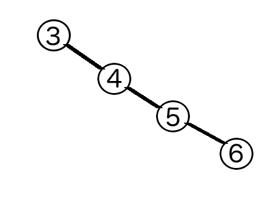

```{r setup, include=FALSE}
knitr::opts_chunk$set(echo = TRUE)
```

Today we're going to talk about a data structure that is very important for linguists: trees. In particular, we're going to talk about two kinds of trees: binary search trees and tries.

<h2>Binary Search Trees</h2>

Binary search trees are aptly named. They are binary trees. And they faciliate searching.

Here is an example of a binary search tree:


Each node can have at most two children. The subtree on the left contains only values smaller than the parent, and the subtree on the right contains only values larger than the parent.

This means that when the root node is selected well, you can search a binary search tree for an arbitrary value in logarithmic (O(log n)) time. This makes them much more efficient to search than lists, which take linear time (O(n)).

What is the best case for binary search? When the root node is the median value. That way, at each node, you can halve the search space.

In the worst-case, the root node is either the largest or smallest value, and the tree becomes equivalent to a list.



Binary search trees are not a built-in data structure in Python. I've written a basic binary search tree class. Don't worry about the syntax of the class definition: just think of this as a function that takes a list and returns a binary search tree.

Details: If given the empty list, the function returns a BST with no nodes (including no root node). If given a list with duplicates, any duplicates are just ignored.

Today we're going to write some methods for binary search trees. First of all, it would be good to have a way of printing the tree.

<h3>Printing a binary search tree</h3>

Let's focus first on printing out the structure of the tree. We can add indentation for each level of the tree.

<h5>See printBST.py</h5>

Well, this lets us look inside the tree, but it's not the most readable. How could we center-print the tree?

<h5>See printBST.py</h5>

That's much better! But we're still manually figuring out the height of the tree... which means that if we have a program that prints out a bunch of these, it won't know what to use as the ind value for each.

Maybe we should add something to keep track of the height of the tree?

<h5>See height.py</h5>

Great, now we can call findHeight, and pass the result as the argument to prettyPrintBST!

<h3>Inserting new values into a binary search tree</h3>

What do we have to do to insert new values into a binary search tree?

Well, if our value is bigger than the root value, we need to search the right subtree, and insert it there. If it's smaller, we need to search the left subtree, and insert it there. (What happens if it is equal to the root value?)

This is a perfect kind of problem to solve with a recursive algorithm.

<h5>See insert.py</h5>

(You can also write this iteratively, but it's a little less intuitive. You can compare our recursive algorithm with the iterative version I wrote in the BST constructor.)
